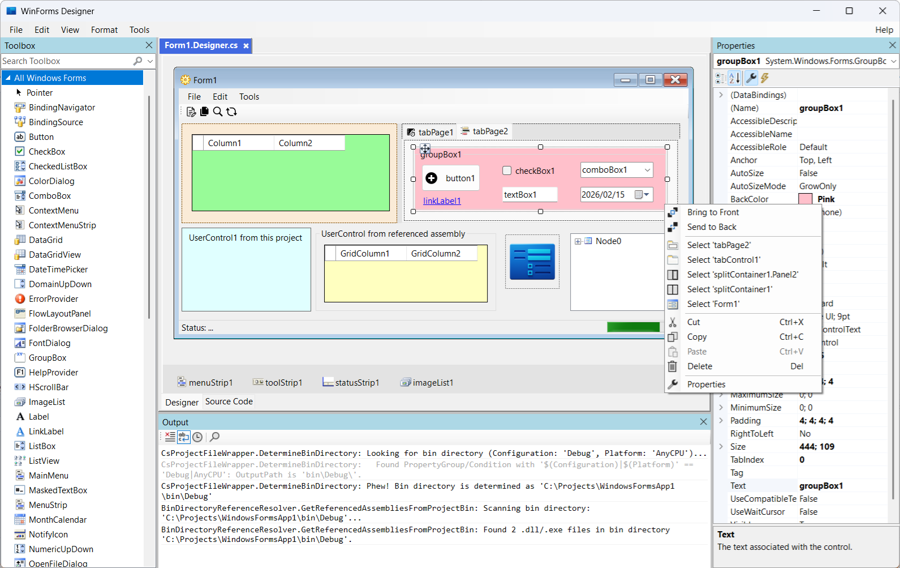
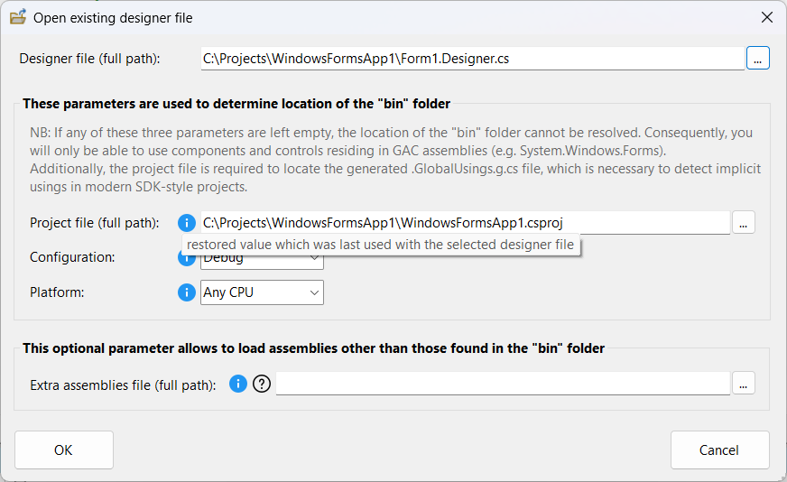
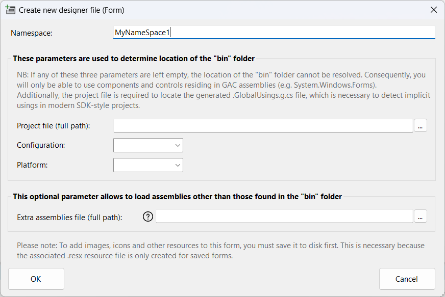
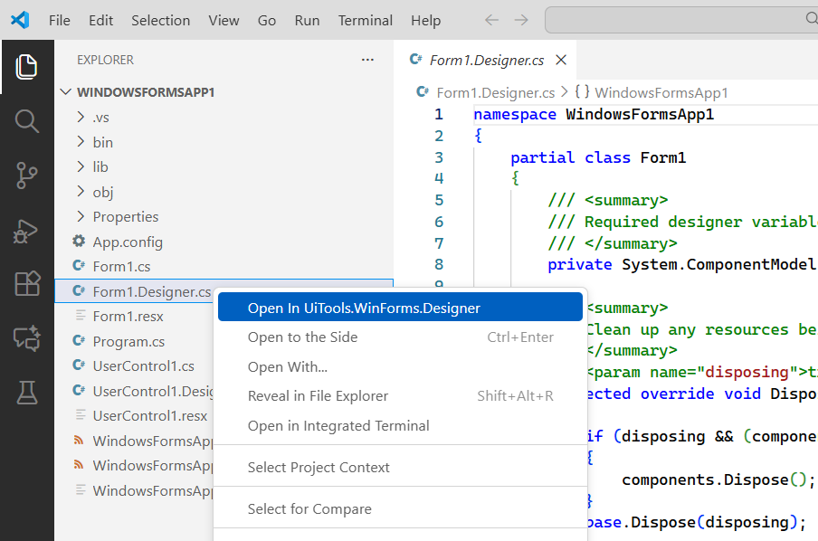
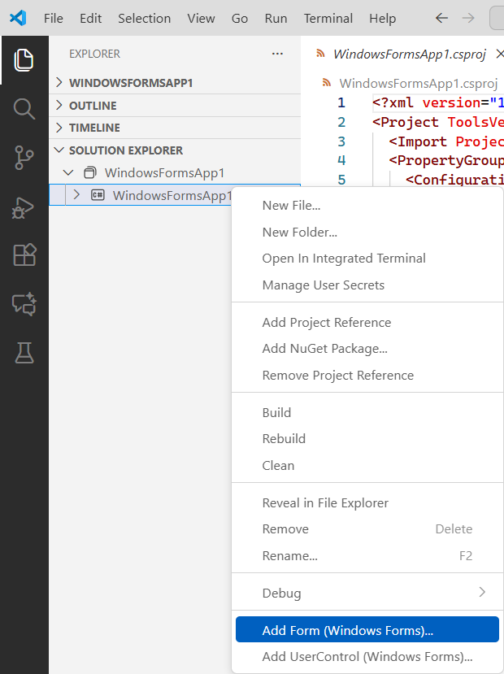
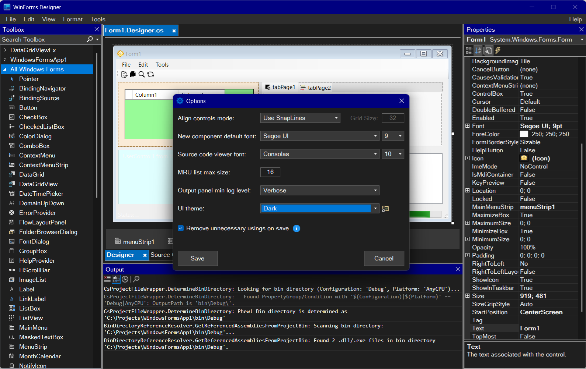
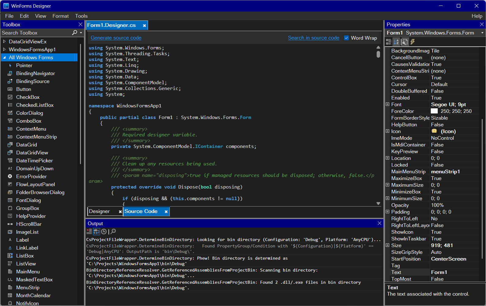
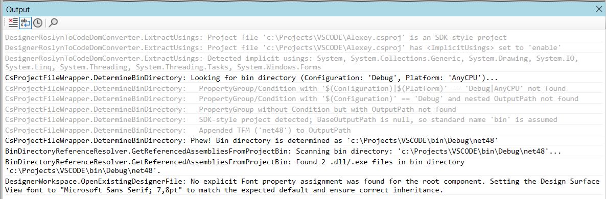
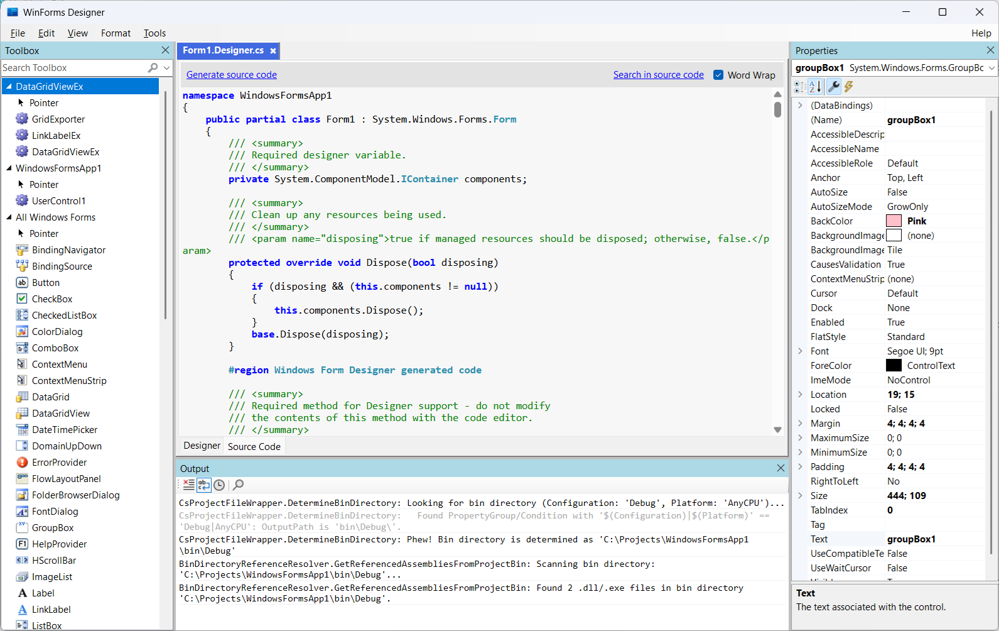

# WinForms Designer for VS Code

**Bring the classic Visual Studio design experience to your favorite lightweight editor.**

While VS Code has become the go-to editor for modern C# development, it has always lacked one crucial feature for desktop developers: a visual designer for Windows Forms. This project bridges that gap by providing a high-fidelity WinForms Designer that works both as a **standalone application** and as a **fully integrated VS Code extension**.

Stop context-switching between "heavy" Visual Studio and VS Code just to move a button. Now you can design, code, and debug all in one place.

### Why this Designer?

*  **Familiarity First:** The UI and functionality are meticulously crafted to mimic the standard Visual Studio experience. From the **Toolbox** to the **Properties Window**, you will feel right at home.
*  **Powered by Microsoft:** This isn't a custom "web-based" approximation. The designer is built using 100% official Microsoft libraries, including **Roslyn** for precise code analysis and the core **System.Windows.Forms.Design** engine for the design surface.
*  **Standalone & Integrated:** Use it as a quick standalone tool to edit any `.designer.cs` file on the fly, or launch it directly from the VS Code context menu for a seamless workflow.
*  **Smart Code Handling:** It reads and writes standard `.designer.cs` files, maintaining the same structure that Visual Studio uses, ensuring your projects remain compatible across different environments.

---
Sample form open in Designer:

Open File Dialog:

  

New File Dialog:

  

## Installation & VS Code Extension

You can integrate the WinForms Designer into your VS Code workflow in two ways:

### 1. Visual Studio Marketplace (Recommended)
The extension is officially available on the **Visual Studio Marketplace**. This is the **SelfContained** version, which works "out of the box" and does not require any additional software to be installed on your machine.

* **Install from Marketplace:** [UiTools WinForms Designer](https://marketplace.visualstudio.com/items?itemName=AlexeyYumashin.uitools-winforms-designer)

### 2. Manual Installation from GitHub
If you prefer to use a specific version, need the **LightWeight** variant, or want to customize the tool, you can install it manually from this repository.

**To build the extension from source code:**
1. Navigate to the **VSIX project folder** in this repository: `UiTools.WinForms.Designer.VsCodeExtension`.
2. Consult the **dedicated [Extension Developer Guide](UiTools.WinForms.Designer.VsCodeExtension/DEVELOPER_GUIDE.md)** inside that folder for step-by-step instructions on packaging the extension.
3. You can choose between two build configurations:
   * **SelfContained:** Includes all necessary runtimes within the `.vsix` package for a "plug-and-play" experience.
   * **LightWeight:** A significantly smaller package that relies on an existing local installation of the `UiTools.WinForms.Designer` standalone app.
4. Once the `.vsix` file is generated, simply open VS Code, go to the "EXTENSIONS" view, click the "..." menu, and select **"Install from VSIX..."**.

---

**VS Code integration:**

Open File in VS Code:

  

Add File in VS Code:

  

---

_**A Note on Architecture:**
This designer uses a sophisticated **heuristic approach** powered by Roslyn to parse and convert code into a CodeDOM structure. By utilizing the same underlying technology as the original IDE, it ensures that the generated code is clean, standard, and production-ready._

---

## UI Themes & Customization

The designer now supports full UI theming, allowing you to match your environment's aesthetic. A UI theme encompasses element colors for all application controls, font settings (family and size), and C# syntax highlighting styles for the "Source code" tab.

#### Key Features:
* **Predefined Themes:** "Light" and "Dark" themes are available out of the box. 
* **Selection:** Themes can be switched in the "Options" dialog under the "UI theme" parameter.
* **Native Mode:** The "None" option (default) reverts all controls to standard WinForms colors. Switching to "None" requires an application restart. 
  _**Note: The "Light" theme is visually almost identical to the "None" option.**_
* **Customization:**
  * Upon the first launch, the designer extracts `UiTools.WinForms.Designer.UiThemes.xml` and its schema `UiTools.WinForms.Designer.UiThemes.xsd` to the application directory. 
  * You can edit existing themes or define your own by modifying this XML file. The XSD schema is provided to prevent errors during manual editing.
* **Syntax Highlighting:** The "Source code" tab uses [`Highlight.js`](https://highlightjs.org). Highlighting is controlled by CSS files (e.g., `Light.css`, `Dark.css`) located in the application folder. 
  * The CSS filename must match the theme name. If "None" is selected, `Light.css` is used.
  * You can modify these predefined CSS files or create new ones for your custom themes.

#### Technical Implementation & Legacy Challenges:
Supporting dark themes in WinForms is a notoriously difficult task. Many WinForms controls are thin wrappers around "ancient" Win32 or ActiveX components dating back to Windows 95. Since many of these controls do not natively support modern skinning, the designer employs several low-level techniques:
* **Owner Draw & WndProc:** For many elements, the only way to "repaint" them is to use "owner draw" mode or, where that is unavailable, to override the control's window procedure (WndProc) to intercept and manually handle painting messages. 
* **Modern Windows APIs:** While the core UI is handled via low-level hooks, the designer utilizes specific Windows APIs to style the "system" parts of the interface (title bars, scrollbars, etc.):
  * **`DWMWA_USE_IMMERSIVE_DARK_MODE`:** Supported on **Windows 10 v1809+**. This tells the Desktop Window Manager to apply the dark system style to the window's frame (making the title bar black and the caption text white).
  * **Title Bar Customization:** Setting a specific background color (**`DWMWA_CAPTION_COLOR`**) or text color (**`DWMWA_TEXT_COLOR`**) for the title bar requires **Windows 11+**. On Windows 10 v1809+, these custom colors are ignored, and the title bar simply defaults to solid black when the immersive dark mode is active.
  * **Scrollbars:** Dark scrollbars are enabled by calling the `SetWindowTheme` function from `uxtheme.dll` with the **"DarkMode_Explorer"** theme parameter (requires **Windows 10 v1809+**).
  * **System Context Menus:** The dark style for the title bar's right-click menu (or Alt+Space menu) is handled via `SetPreferredAppMode` and `FlushMenuThemes` (requires **Windows 10 v1809+**).

#### A Note on Stability:
While great care has been taken to avoid flickering during runtime theme switching and to prevent layout breakage due to font changes, some minor visual glitches may occur. 
* **Font Size:** Increase the theme's font size with caution; excessively large fonts may disrupt the layout in certain areas despite auto-scaling efforts.
* **Fallback:** Given the complexity of skinning legacy Win32 components, if you encounter any critical errors or visual bugs, please set the UI theme to "None". This will completely deactivate all skinning logic. If you find a bug, please report it on GitHub.

---

## Limitations:
Typical `.designer.cs` file created by Visual Studio is supported (VB.NET is not supported, but it's not very difficult to fork and modify this project to support it):
* Name pattern: `<FILE_NAME>.designer.cs` (e.g. `Form1.designer.cs`, `UserControl1.designer.cs`)
* Name pattern for the 2nd part of the class: `<FILE_NAME>.cs` (e.g. `Form1.cs`, `UserControl1.cs`)
* Only one class must reside in the `.designer.cs` file
* No nested namespaces supported (only the top one will be taken into account)
* File should not contain generics, lambdas or any other syntax sugar (actually, `InitializeComponent` method never contains such things, but user-defined methods - if any - may contain)
* Namespaces must be the same in both parts of the file (e.g. in `Form1.cs` and `Form1.designer.cs`), or must be absent in both parts
* Properties `GenerateMembers` and `Modifiers` are not supported: they are not displayed in the "Properties" window, and their values are assumed to be `true` and `Private` respectively.
* Toolbox window has no context menu - so you cannot cut/copy/paste/delete/rename/reorder components, add/delete/rename tabs, choose items, show non-.NET items. Toolbox is filled with components contained in the following places: (1) `System.Windows.Forms` assembly, (2) project the `.designer.cs` file belongs to, and (3) assemblies referenced from this project (designer finds these assemblies by scanning `bin` directory of the project).
* Toolbox window does not contain `MessageQueue` component as it needs MSMQ to be installed. Stock Form Designer (from Visual Studio) raises error if you try to add this component to your form when MSMQ is not installed - that's why I decided to skip this component when populating Toolbox.
* Comments and code regions (except the standard ones) are not preserved; they do not prevent loading the file, but are not preserved when saving the file
* Resources support is limited to images, icons, strings. Project-level resource files (usually `Properties\Resources.resx`) are supported as well. Localizable forms are **not** supported.
* Editing `.designer.cs` file directly (in any external editor) - while Form/UserControl is open in Designer - does not update the Designer; this is different from Visual Studio behavior.
* Code of the `.designer.cs` file (the Form/UserControl is loaded from) is first processed by **Roslyn** to convert it to `CodeTypeDeclaration` which can then be passed to `TypeCodeDomSerializer`. This conversion procedure sometimes relies on **heuristic** analysis (e.g. to distinguish between fields and properties in certain cases), so it's not a 100% reliable approach. To get an absolutely reliable approach, one should build the **semantic model** of the code (and that's tricky, heavy and slow) and then use it for scrupulous code analysis (leaving no place for heuristics). I decided to keep the heuristic approach meanwhile - seems that it successfully covers most of the cases. See the `DesignerRoslynToCodeDomConverter` class if you need more details.

## Grey area:
* `ApplicationSettings` and `DataBindings`: I never use them, so I didn't check whether these guys are handled correctly
* I'm not sure that I did my best to correctly handle the **autoscaling stuff** - all those `AutoScaleMode`, `AutoScaleDimensions` and `PerformAutoScale()`. In fact I care only about the following 3 points:
    + **(1)** Preserve root component Font: when `DesignSurface` is placed in a container - root component (of this `DesignSurface`) will inherit container's Font, and as far as I can't prevent this - I have to pre-emptively set container's Font to the root component's Font - see `DesignerFileDeserializer.ExtractRootComponentFont()` method;
    + **(2)** Preserve root component autoscaling stuff and dimensions: again, when `DesignSurface` is placed in a container - root component may change its `AutoScaleMode` and/or `AutoScaleDimensions` value, so to prevent this I firstly store these three values and later restore them - see methods `StoreScalingStuff()` and `RestoreScalingStuff()`;
    + **(3)** If the `.designer.cs` file contains assignments to `AutoScaleDimensions` and `AutoScaleMode` properties (in this particular order) - I reverse this order to "_first_ `AutoScaleMode`, _then_ `AutoScaleDimensions`" on load, otherwise root component is scaled improperly (at least when `AutoScaleMode` is set to `AutoScaleMode.Dpi`).

Well, these 3 points are probably a primitive way to address autoscaling problems, however I couldn't dig up something better.

## Specifics:
* You must build your project (containing the form) before opening this form in this designer (because designer scans `bin` directory for referenced assemblies)
* Constructor should reside in the 2nd part of the class (e.g. `Form1.cs`, `UserControl1.cs`). If it resides right in the `.designer.cs` file - `.designer.cs` file will be loaded correctly, but later (when saving this file to disk) constructor will be removed.
* Access modifier can be absent (e.g. "`partial class Form1 : System.Windows.Forms.Form`" - no "`public`" in the beginning); in such case access modifier will be picked up from the 2nd part of the class (e.g. `Form1.cs`)
* Base type reference can be absent (e.g. "`partial class Form1`" - no "` : System.Windows.Forms.Form`" in the end); in such case it will be picked up from the 2nd part of the class
* Base type reference can be a short name (e.g. "`partial class Form1 : Form`" - no namespace qualifier for "`Form`" type); however this assumes that `.designer.cs` file or its 2nd part contains the appropriate namespace import (e.g. "`using System.Windows.Forms;`")
* User methods - if any - are preserved (and stored in the end of the class); and as already said above - they should not contain generics, lambdas or any other syntax sugar
* Redundant namespace imports ("`using`" statements) can be created in the `.designer.cs` file if you set option "Remove unnecessary usings on save" to `false`.

## More screenshots:

Output Panel Sample:

  

Source Code Viewer:

