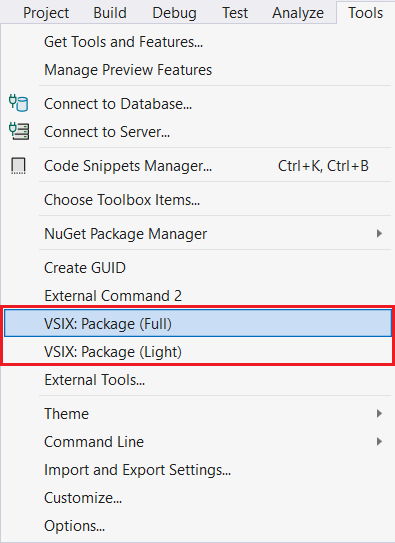
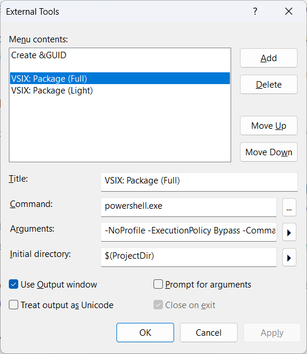

# UiTools.WinForms.Designer.VsCodeExtension: Developer Guide

This project provides a Visual Studio Code extension for designing WinForms forms and usercontrols using a dedicated C# WinForms Designer application (UiTools.WinForms.Designer). It offers two distinct build and distribution modes: **Self-Contained (Full)** and **Lightweight**.

*This document explains the internal architecture, build process, and packaging logic for the WinForms Designer VS Code extension.*

## 1. Project Structure & Core Components

The solution consists of three main projects:

*   **`UiTools.WinForms.Designer.csproj`**: This is the main C# WinForms application containing the main form of the application, related usercontrols, application settings stuff, Named Pipes support. It's a standard .NET executable (`.exe`).
*   **`UiTools.WinForms.Designer.Core.csproj`**: This project contains the core functionality used by the main application. It's a standard .NET library (`.dll`).
*   **`UiTools.WinForms.Designer.VsCodeExtension.esproj`**: This is the Visual Studio Code extension project (TypeScript/JavaScript). It contains the VS Code integration logic.

## 2. Build Dependencies

The `UiTools.WinForms.Designer.VsCodeExtension.esproj` project has a **build dependency** on `UiTools.WinForms.Designer.csproj`. This means that whenever you build the VS Code extension project, the C# UiTools.WinForms.Designer application will also be built first.

## 3. The `VSIX-bin` Folder

This folder plays a crucial role in the **Self-Contained** build mode.

*   **Purpose:** It acts as a temporary staging area for the compiled C# `UiTools.WinForms.Designer` application and its dependencies. When the VS Code extension is packaged in **Self-Contained** mode, the contents of the `VSIX-bin` folder are bundled directly into the `.vsix` file.
*   **Managed by MSBuild:** This folder is populated (or cleaned) by `PostBuildEvent` targets within the `UiTools.WinForms.Designer.csproj` file (see section 4).

## 4. Build Configurations: Self-Contained vs. Lightweight

The solution defines special build configurations to manage the two distribution modes:

*   **`Debug-SelfContained`** / **`Release-SelfContained`**:
    *   **Behavior:** When the C# `UiTools.WinForms.Designer` project is built in these configurations, a `PostBuildEvent` automatically **cleans** the `VSIX-bin` folder (preventing accidental inclusion of old binaries) and then **copies** all compiled C# artifacts (`UiTools.WinForms.Designer.exe`, `.dll`s, etc.) into the `VSIX-bin` folder.
    *   **Result:** This prepares the extension to be packaged as a single, self-sufficient `.vsix` file containing both the VS Code logic and the C# `UiTools.WinForms.Designer` application.

*   **`Debug-Lightweight`** / **`Release-Lightweight`**:
    *   **Behavior:** When the C# `UiTools.WinForms.Designer` project is built in these configurations, a `PostBuildEvent` will **clean (delete)** the `VSIX-bin` folder. No C# artifacts are copied into it.
    *   **Result:** This ensures that the `VSIX-bin` folder is empty as it is expected when packaging the **Lightweight** version of the extension. It also makes the extension ready to rely on an **external** `UiTools.WinForms.Designer` application.

**Important Note:** Switching between these configurations and performing a `Rebuild Solution` is critical to ensure `VSIX-bin` is in the correct state for the subsequent packaging step.

## 5. Packaging the Extension (`.vsix`)

The packaging process is separate from the standard Visual Studio build. It is handled by `npm` scripts and `vsce` (Visual Studio Code Extension tool).

### 5.1 `prepackage.js` Script

Located in the `scripts/` folder, this script is crucial for managing the packaging process:

*   **Validation:** For **Self-Contained** packaging, it performs a critical check: if `VSIX-bin/UiTools.WinForms.Designer.exe` is missing, it will **abort the packaging process** with an error. This prevents creating an empty or broken Full VSIX package.
*   **Dynamic `.vscodeignore`:** It dynamically creates or updates the `.vscodeignore` file *just before* `vsce` runs. This file tells `vsce` exactly which files to include or exclude from the `.vsix` package.
*   **Whitelisting:** It uses a whitelisting approach: it first tells `vsce` to ignore `**/*` (everything), and then explicitly adds `!` (negation) rules for files that *should* be included (e.g. `!out/**`, `!package.json`). This ensures that only explicitly whitelisted files are included in the package.
*   **Mode Awareness:** Based on command-line arguments (`--light`), it decides whether to include or exclude the `VSIX-bin/**` folder from the final package.

### 5.2 `package-full` and `package-light` Scripts

These are `npm` scripts defined in `package.json` that orchestrate the packaging:

*   **`package-full`**:
    *   `npm run clean-vsix`: Cleans any previous `.vsix` files.
    *   `npm run compile`: Compiles the TypeScript code to JavaScript.
    *   `node ./scripts/prepackage.js`: Runs the script to configure `.vscodeignore` for **Full** mode (including `VSIX-bin`).
    *   `npx vsce package ...`: Packages the extension into `VSIX/UiTools.WinForms.Designer.Full.vsix`.
    *   **Use Case:** For publishing to the VS Code Marketplace or for users who want a self-contained, out-of-the-box experience.

*   **`package-light`**:
    *   `npm run clean-vsix`: Cleans any previous `.vsix` files.
    *   `npm run compile`: Compiles the TypeScript code to JavaScript.
    *   `node ./scripts/prepackage.js --light`: Runs the script to configure `.vscodeignore` for **Lightweight** mode (excluding `VSIX-bin`).
    *   `npx vsce package ...`: Packages the extension into `VSIX/UiTools.WinForms.Designer.Light.vsix`.
    *   **Use Case:** For developers or advanced users who want to run the `UiTools.WinForms.Designer` application *externally* (e.g. from their local `bin/Debug` folder) or manage its updates separately.

### 5.3 External Tools Integration (Visual Studio)

The `package-full` and `package-light` scripts can be invoked as "External Tools" in Visual Studio. To set them up:

1.  Open Visual Studio.
2.  Go to `Tools` -> `External Tools...`.
3.  Click `Add` to create a new tool.

#### For `VSIX: Package (Full)`:
*   **Title:** `VSIX: Package (Full)`
*   **Command:** `powershell.exe`
*   **Arguments:** `-NoProfile -ExecutionPolicy Bypass -Command "npm run package-full"`
*   **Initial Directory:** `$(ProjectDir)`
*   **Use Output window:** Checked.

#### For `VSIX: Package (Light)`:
*   **Title:** `VSIX: Package (Light)`
*   **Command:** `powershell.exe`
*   **Arguments:** `-NoProfile -ExecutionPolicy Bypass -Command "npm run package-light"`
*   **Initial Directory:** `$(ProjectDir)`
*   **Use Output window:** Checked.

After setup, you can access these commands via `Tools` -> `External Tools`. Ensure you `Build` your solution in the desired configuration *before* packaging.

**Root "Tools" menu:**

  

**"External Tools" submenu:**

  

## 6. UiTools.WinForms.Designer Executable Path Resolution

The VS Code extension needs to know where the `UiTools.WinForms.Designer.exe` application is located. This logic is implemented in the `getDesignerAppExecutablePath()` method (in `designerLauncher.ts`) and is configurable by the user.

*   **Settings Property:** Users can specify an absolute path to the `UiTools.WinForms.Designer` executable via the VS Code setting:
    `uitools-winforms-designer.designerExePath`
    This setting is accessible through VS Code's Settings UI (`Ctrl+,` -> search for "UiTools").

*   **Resolution Logic:**
    1.  The extension first checks the `uitools-winforms-designer.designerExePath` setting.
        *   **In Lightweight Mode:** This setting is **mandatory**. If the path is not provided or is invalid, the `UiTools.WinForms.Designer` application will not launch.
        *   **In Self-Contained Mode:** This setting acts as an **override**. It allows developers to point to their local C# `UiTools.WinForms.Designer` build (`bin/Debug`) for rapid testing without repackaging, or for advanced users to specify an alternative `UiTools.WinForms.Designer` executable.
    2.  If the setting is empty or points to a non-existent file, the extension then looks for the built-in executable within the `VSIX-bin/` folder of its own installation directory (this step is only relevant for **Self-Contained** installations).
    3.  If neither is found, an error message is displayed to the user, suggesting they either provide a valid path in Settings or install the self-contained VSIX version.

## Conclusion

This setup provides a flexible and robust way to manage your VS Code extension's distribution, catering to both **self-contained** deployments and more modular, **lightweight** use cases. Always ensure your C# solution is rebuilt in the correct configuration before packaging the extension.
